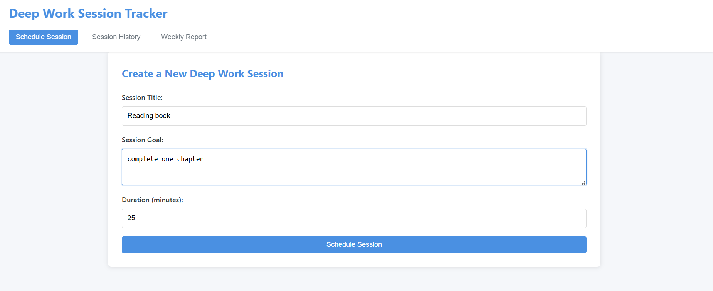
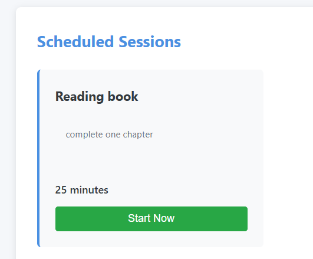
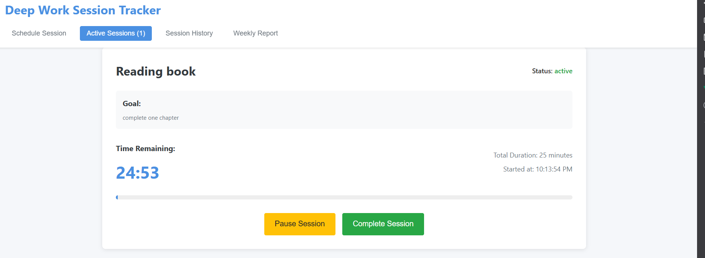
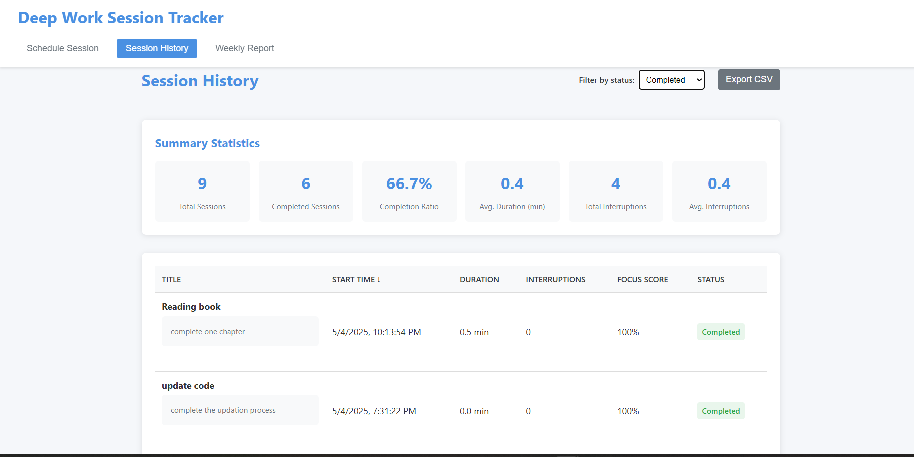
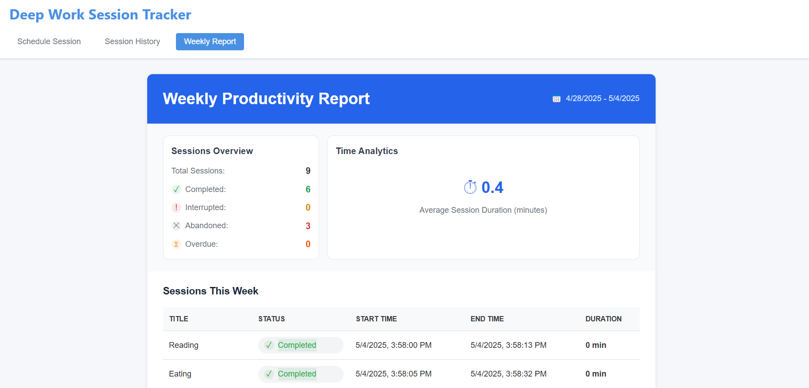

```markdown
# Deep Work Session Tracker

A productivity app to schedule, track, and review deep work sessions.  
**Backend:** FastAPI, SQLModel, Alembic  
**Frontend:** React  
**SDK:** Auto-generated Python client for API consumption (in `sdk/` folder)

---

## Features

- Schedule sessions with title, goal, and duration
- Start, pause, resume, and complete sessions
- Track interruptions with reasons
- Session statuses: scheduled, active, paused, completed, interrupted, abandoned, overdue
- Focus score based on interruptions
- Weekly productivity report
- CSV export of session history
- Real-time session timer

---

## Getting Started

### 1. Clone the repository

Clone the repository to your local machine using the following command:

```bash
git clone https://github.com/ezhil020/deep-work-session-tracker.git
cd deep-work-session-tracker
```

---

### 2. Setup (Windows)

Run the setup script from the project root:

```bash
setupdev.bat
```

This will:
- Set up a Python virtual environment and install backend dependencies.
- Run Alembic migrations to set up the database.
- Install frontend dependencies.

---

### 3. Run the Application

From the project root, run:

```bash
runapplication.bat
```

- Start the FastAPI backend at [http://localhost:8000](http://localhost:8000).
- Start the React frontend at [http://localhost:3000](http://localhost:3000).

---

### 4. Manual Setup (if not using script)

#### 4.1 Backend

```bash
cd backend
python -m venv env
env\Scripts\activate
pip install -r requirements.txt
alembic upgrade head
uvicorn main:app --reload
```

#### 4.2 Frontend

```bash
cd deepwork_Frontend
npm install
npm start
```

---

## Alembic Migrations

To create a new migration after changing models:

```bash
cd backend
alembic revision --autogenerate -m "Describe your change"
alembic upgrade head
```

---

## Python SDK

The `sdk/` folder contains a generated Python client for the API.

sdk/ sdk_usage.py -  sample script using the SDK


## Application Screenshots

### schedule a session


### start a session


### Active sessions


### Session history


### Weekly_report


